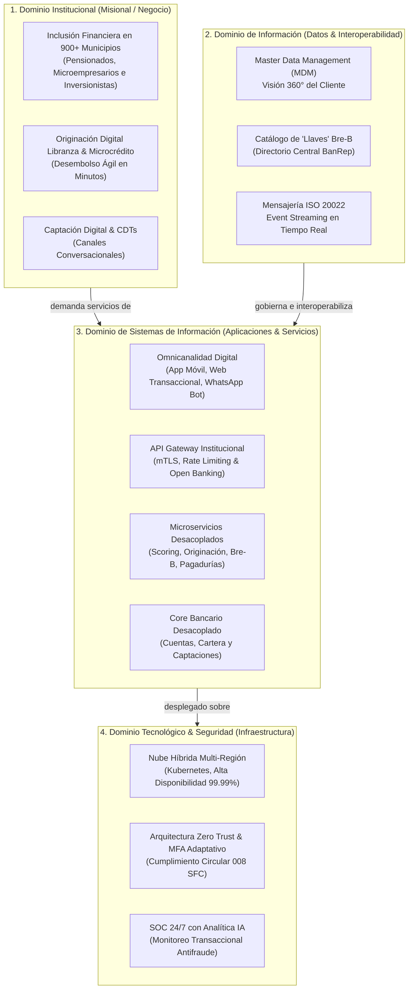
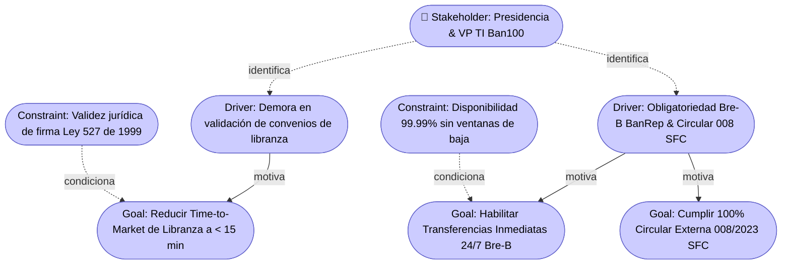

# Documento de Visión de Arquitectura: Ban100

## Cliente
**Ban100 (Establecimiento Bancario Comercial)** — Entidad supervisada por la Superintendencia Financiera de Colombia (SFC).

## Integrantes del Equipo
- **Santiago Barrera Rueda**
- **Krish Purmessur Moros**
- **Samuel Guerrero Arcos**

**Fecha:** 21 de Agosto de 2026  
**Marco de Referencia:** MRAE v3.0 MinTIC / TOGAF ADM (Fase Preliminary & Architecture Vision)

---

## Mapa Conceptual de Alto Nivel

El siguiente diagrama conceptual sintetiza la arquitectura objetivo para la transformación digital de Ban100, articulando los dominios Misional (Negocio), Información, Sistemas (Aplicaciones) e Infraestructura Tecnológica/Seguridad bajo el Marco de Referencia de Arquitectura Empresarial (MRAE v3.0 MinTIC):

---

## Matriz de Beneficios Esperados

Cada beneficio de la arquitectura se encuentra estrictamente alineado con los objetivos estratégicos definidos en la Ficha de Caracterización del Cliente:

| Objetivo Estratégico (Ficha) | Beneficio Esperado de la Arquitectura | Métrica / Cómo se Mide | Meta Cuantitativa |
|---|---|---|---|
| **1. Escalar la Inclusión Financiera Multicanal** | Desmaterialización 100% digital del proceso de originación de libranza y microcrédito en 900+ municipios sin necesidad de trámites físicos. | Tiempo de ciclo de originación (Time to Money) y porcentaje de colocación digital. | Reducción del 70% en el tiempo de aprobación y desembolso (de 3-5 días a < 15 minutos). |
| **2. Habilitación de Pagos Inmediatos 24/7 (Bre-B)** | Procesamiento continuo de transferencias interoperables en tiempo real mediante Llaves y códigos QR bajo estándar ISO 20022. | Tasa de éxito transaccional y disponibilidad del módulo Bre-B. | SLA de disponibilidad del 99.99% y latencia transaccional < 3 segundos. |
| **3. Optimización de Eficiencia Operativa** | Automatización de la consulta de cupos con pagadurías e integración con Truora para biometría y firma electrónica (Ley 527). | Costo operativo por operación procesada y tasa de conversión digital. | Reducción del 90% en costos operativos de renovación de CDTs y aumento del 30% en conversión. |
| **4. Cumplimiento Regulatorio y Resiliencia SFC** | Implementación del modelo Zero Trust, autenticación reforzada adaptativa y SOC con IA predictiva para monitoreo antifraude. | Nivel de conformidad con la Circular Externa 008/2023 SFC e índice de incidentes de seguridad. | 100% de cumplimiento en auditorías de la SFC y 0 incidentes no mitigados en pasarelas. |

---

## Delimitación del Alcance

| En Alcance (In Scope) | Fuera de Alcance (Out of Scope) |
|---|---|
| • Diseño de la arquitectura objetivo (TO-BE) en los 5 dominios del MAE (Institucional, Información, Sistemas, Tecnología y Seguridad) bajo el MRAE v3.0 MinTIC. | • Desarrollo e implementación de código fuente productivo (el alcance del curso cubre el diseño arquitectural y no la construcción de software). |
| • Modelado del proceso BPMN 2.0 para la Originación Digital de Libranza con integración a Truora, Pagadurías y Bre-B. | • Reemplazo integral del software ERP financiero administrativo o de herramientas ofimáticas corporativas. |
| • Definición del Modelo de Información (ERD) para Master Data de Clientes, Productos de Crédito/CDT, Catálogo de Llaves Bre-B y Logs SFC. | • Modificación de las tasas de interés o condiciones comerciales crediticias fijadas por la mesa de dinero del banco. |
| • Diagrama de Contexto de Negocio que delimita el límite organizacional frente a Pagadurías, Truora, BanRep (Bre-B), BTG Pactual y SFC. | • Gestión física de transporte de valores o custodia presencial de efectivo en oficinas bancarias. |
| • Hoja de ruta de transformación estructurada en 3 Horizontes y articulada con los modelos de gobierno MGGTI y proyectos MGPTI. | • Negociación jurídica directa de los convenios colectivos con las pagadurías públicas. |

---

## Justificación Estratégica

La Visión de Arquitectura propuesta para Ban100 responde directamente a los desafíos estructurales identificados en el diagnóstico institucional. La transición de un modelo operativo basado en sucursales físicas y validaciones manuales de pagadurías hacia un ecosistema financiero digital e interoperable requiere desacoplar el Core Bancario monolítico tradicional. Mediante la adopción de una capa de **Microservicios orquestados y gestionados por un API Gateway institucional**, Ban100 adquiere la agilidad requerida para exponer y consumir servicios estándar (APIs RESTful e ISO 20022), acelerando su integración con la infraestructura central del Banco de la República (**Bre-B**) y aliados de autenticación biométrica como **Truora**.

En el ámbito de la información y la infraestructura, la implementación de un **Master Data Management (MDM)** y el procesamiento por eventos (Event Streaming) eliminan la dependencia de los procesos por lotes nocturnos (Batch), permitiendo que la entidad disponga de saldos y catálogos de "Llaves" actualizados en tiempo real las 24 horas del día, los 7 días de la semana. Esta capacidad es indispensable para cumplir con la promesa de valor de los pagos inmediatos y para garantizar una experiencia de usuario fluida a los más de 250.000 clientes en los 900 municipios donde la entidad opera.

Finalmente, la integración transversal de un modelo de seguridad **Zero Trust** y el despliegue de un **Centro de Operaciones de Ciberseguridad (SOC)** respaldado por analítica predictiva de inteligencia artificial proporcionan el blindaje normativo necesario frente a la **Circular Externa 008 de 2023 de la Superintendencia Financiera de Colombia**. Esto asegura que el crecimiento en volumen transaccional y la apertura a canales conversacionales (WhatsApp) se realicen bajo los más altos estándares de autenticación robusta, trazabilidad inmutable y confidencialidad de la información.

---

## Vista ArchiMate Equivalente (Capa de Motivación)

En correspondencia con los lineamientos metodológicos de TOGAF y ArchiMate, los elementos de la Ficha de Caracterización y la Visión se mapean en la capa de motivación:

---

_Este documento hace parte de la entrega del Taller 0 del curso AREM (Arquitectura Empresarial) - Universidad de La Sabana._

