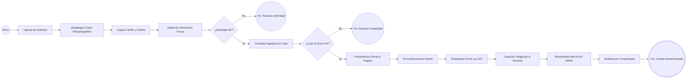
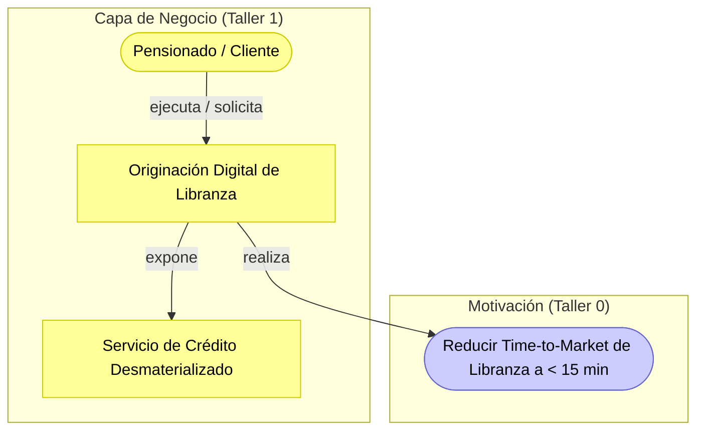

# Informe Técnico del Taller 1: Modelado de Procesos de Negocio (BPMN 2.0)

## Nombre del Taller
**Taller 1 — Modelado de Procesos de Negocio con BPMN 2.0: Caso Ban100**  
*Proceso Misional: Originación y Desembolso Digital de Crédito de Libranza*

## Integrantes del Equipo
- **Santiago Barrera Rueda**
- **Krish Purmessur Moros**
- **Samuel Guerrero Arcos**

**Fecha:** 21 de Agosto de 2026  
**Curso:** Arquitectura Empresarial (AREM) — Universidad de La Sabana  
**Entregable del Diagrama:** [`ban100-bpmn-originacion-libranza.drawio`](ban100-bpmn-originacion-libranza.drawio)

---

## 1. Descripción General del Trabajo

El objetivo de este taller consistió en modelar bajo el estándar internacional **BPMN 2.0 (Business Process Model and Notation)** el proceso misional más representativo y estratégico para la transformación digital de **Ban100**: la **Originación y Desembolso Digital de Créditos de Libranza**.

Ban100 cuenta con una base de más de 250.000 clientes (principalmente pensionados y empleados públicos) distribuidos en más de 900 municipios. Históricamente, este proceso requería de presencia física, recopilación de documentos en papel y validación manual de convenios con pagadurías, tardando entre 3 y 5 días hábiles. El modelo propuesto desmaterializa el 100% del flujo mediante la integración automatizada con la plataforma **Truora** (para biometría facial y firma electrónica certificada bajo la Ley 527 de 1999), un **Motor de Reglas y Pagadurías** para consulta en tiempo real de cupos, y la conexión al sistema de **Pagos Inmediatos Bre-B** del Banco de la República para desembolso instantáneo 24/7/365.

Esta solución representa la vía de implementación de **menor riesgo operativo y máximo impacto de negocio**, permitiendo reducir los tiempos de respuesta a menos de 15 minutos sin comprometer el control del riesgo crediticio ni la validez jurídica de los títulos ejecutivos.

---

## 2. Proceso de Desarrollo y Metodología

Para garantizar el rigor metodológico del modelo, se siguió la metodología en 5 pasos recomendada en la guía del curso:

1. **Identificación de Actores y Carriles (*Lanes*):**  
   Se estructuró un *Pool* principal denominado **"Originación Digital de Libranza"**, dividido en 5 carriles especializados para separar las responsabilidades humanas, de canal, de aliados tecnológicos y del backend bancario:
   - **Carril 1 (Pensionado / Cliente):** Actor solicitante que interactúa con la interfaz.
   - **Carril 2 (Canal Digital / WhatsApp):** Capa conversacional y web que gestiona la interacción.
   - **Carril 3 (Plataforma Truora):** Proveedor de servicios especializados de biometría y firma electrónica.
   - **Carril 4 (Motor Reglas & Pagadurías Ban100):** Microservicio interno de validación de convenios, políticas y capacidad de endeudamiento.
   - **Carril 5 (Core Bancario & Bre-B Ban100):** Sistemas transaccionales de creación de cartera, registro en Deceval y desembolso interbancario inmediato.

2. **Definición de Inicio y Fin:**  
   - *Evento de Inicio:* Disparado por la solicitud del cliente ("Solicitud de Libranza").
   - *Eventos de Fin:* Se definieron tres posibles desenlaces: dos eventos de terminación por rechazo debidamente tipificados ("Rechazo por Identidad" y "Rechazo por Capacidad") y un evento de éxito final ("Crédito Desembolsado y Notificado").

3. **Secuenciamiento de Actividades:**  
   Se definieron tareas atómicas con verbos de acción precisos, tales como *Ingresar datos y monto*, *Desplegar interfaz conversacional*, *Validar biometría facial y OCR documento*, *Consultar convenio con pagaduría*, *Estampar firma electrónica* y *Desembolso Inmediato vía Bre-B*.

4. **Inclusión de Compuertas de Decisión (Gateways XOR):**  
   Se incorporaron dos puntos de decisión exclusivos con sus respectivas salidas etiquetadas de forma explícita:
   - `¿Identidad Válida?` (Sí / No) — En el carril de Truora.
   - `¿Cupo y Scoring OK?` (Sí / No) — En el carril del Motor de Pagadurías.

5. **Conexión, Validación y Verificación de Flujo:**  
   Se enlazaron todos los nodos mediante flujos de secuencia ortogonales limpios, asegurando que no existan actividades aisladas y que el diagrama se lea de forma natural de izquierda a derecha.

---

## 3. Análisis del Modelo Propuesto

### Estructura y Flujo Lógico del Negocio

### Principales Supuestos y Decisiones de Diseño

1. **Validez Jurídica del Pagaré Desmaterializado (Ley 527 de 1999):** El modelo no requiere firma manuscrita ni desplazamiento a oficinas. La firma electrónica se complementa con estampado cronológico (*Time-stamping*) y custodia digital del pagaré en Deceval.
2. **Desacoplamiento mediante Microservicios y APIs:** La interacción entre el Canal WhatsApp, Truora y el Core Bancario se ejecuta a través de llamadas API REST síncronas gestionadas por el API Gateway, evitando integraciones punto a punto monolíticas.
3. **Liquidación Inmediata con Bre-B (ISO 20022):** El desembolso del crédito se realiza directamente a la cuenta inscrita del pensionado mediante el riel de pagos inmediatos 24/7 del Banco de la República, reduciendo la espera de compensación ACH tradicional de 24 horas a segundos.

---

## 4. Diagrama Final Entregado

El diagrama oficial fue construido y optimizado en formato nativo Draw.io:
- **Archivo editable:** [`ban100-bpmn-originacion-libranza.drawio`](ban100-bpmn-originacion-libranza.drawio)
- **Instrucciones de apertura:** Puede abrirse directamente en VS Code utilizando la extensión `hediet.vscode-drawio` o en el entorno web [app.diagrams.net](https://app.diagrams.net/).

---

## 5. Tabla de Actores, Carriles y Componentes

| Carril / Componente | Tipo | Descripción de la Responsabilidad en el Proceso | Responsable |
|---|---|---|---|
| **Pensionado / Cliente** | Actor de Negocio | Inicia el trámite, suministra datos personales, realiza la prueba de vida (selfie), valida condiciones financieras y firma el pagaré. | Cliente Final |
| **Canal Digital / WhatsApp** | Sistema / Canal | Interfaz de cara al usuario que guía la conversación, captura imágenes y entrega comprobantes digitales. | Dirección de Canales Ban100 |
| **Plataforma Truora** | Sistema Externo (SaaS) | Ejecuta validación biométrica facial contra registros oficiales, OCR de cédula y estampa la firma electrónica con certificación de tiempo. | Aliado Tecnológico Truora S.A.S. |
| **Motor Reglas & Pagadurías** | Microservicio Interno | Consulta el convenio institucional de libranza, calcula el cupo disponible de la mesada pensional y evalúa el score crediticio. | VP de Riesgos / TI Ban100 |
| **Core Bancario & Bre-B** | Sistema Transaccional | Registra la cartera activa, genera la obligación en Deceval y ordena la transferencia inmediata de fondos bajo mensajería ISO 20022. | Operaciones y TI Ban100 |

---

## 6. Investigación Complementaria

### Tema Investigado:
*Optimización de Procesos de Originación de Crédito en Banca Digital mediante BPMN 2.0, Validez Jurídica de Mensajes de Datos (Ley 527) y Pagos Inmediatos (Bre-B).*

### Resumen Técnico:
El modelado de procesos en el sector bancario bajo BPMN 2.0 permite cerrar la brecha entre los requerimientos de cumplimiento normativo y la arquitectura de software subyacente. En Colombia, el reto principal en la originación digital de créditos de libranza reside en conjugar tres elementos críticos: la certeza sobre la identidad del solicitante para mitigar el riesgo de suplantación, la exigibilidad jurídica del título valor (pagaré) y la velocidad de desembolso.

La adopción de compuertas exclusivas de decisión temprana para la validación biométrica (respaldada en el estándar FIDO y algoritmos de prueba de vida activa/pasiva) permite filtrar transacciones sospechosas antes de consumir capacidades de cómputo en la consulta de centrales de riesgo y pagadurías. Asimismo, la incorporación de la Ley 527 de 1999 mediante mensajes de datos y firmas electrónicas certificadas otorga al pagaré desmaterializado la misma fuerza probatoria y ejecutiva que un documento físico sobre papel. 

Finalmente, la orquestación del flujo hacia el ecosistema **Bre-B** del Banco de la República representa una evolución paradigmática: el proceso no termina en una orden de lote ACH pendiente de compensación bancaria al día siguiente, sino en una liquidación bruta en tiempo real (LBTR) con confirmación instantánea bajo el estándar de mensajería financiera internacional **ISO 20022 (pacs.008)**, maximizando la satisfacción del usuario y posicionando a Ban100 a la vanguardia de la inclusión financiera.

---

## 7. Vista ArchiMate Equivalente (Capa de Negocio)

---

## 8. Referencias Bibliográficas

- [1] Object Management Group (OMG). *Business Process Model and Notation (BPMN) Version 2.0.2*. OMG Document formal/2013-12-09. Disponible en: https://www.omg.org/spec/BPMN/2.0.2/
- [2] Congreso de la República de Colombia. *Ley 527 de 1999: Por medio de la cual se define y reglamenta el acceso y uso de los mensajes de datos, del comercio electrónico y de las firmas digitales*. Diario Oficial No. 43.673.
- [3] Banco de la República de Colombia. *Reglamentación del Sistema de Pagos Inmediatos Interoperables (Bre-B) y Adopción del Estándar ISO 20022*. Circular Reglamentaria Externa DSP-2023.
- [4] Ministerio de Tecnologías de la Información y las Comunicaciones (MinTIC). *Marco de Referencia de Arquitectura Empresarial (MRAE v3.0) — Dominio Institucional y Modelo de Procesos*. Bogotá D.C., 2023.

---

_Este documento hace parte de la entrega del Taller 1 del curso AREM (Arquitectura Empresarial) - Universidad de La Sabana._