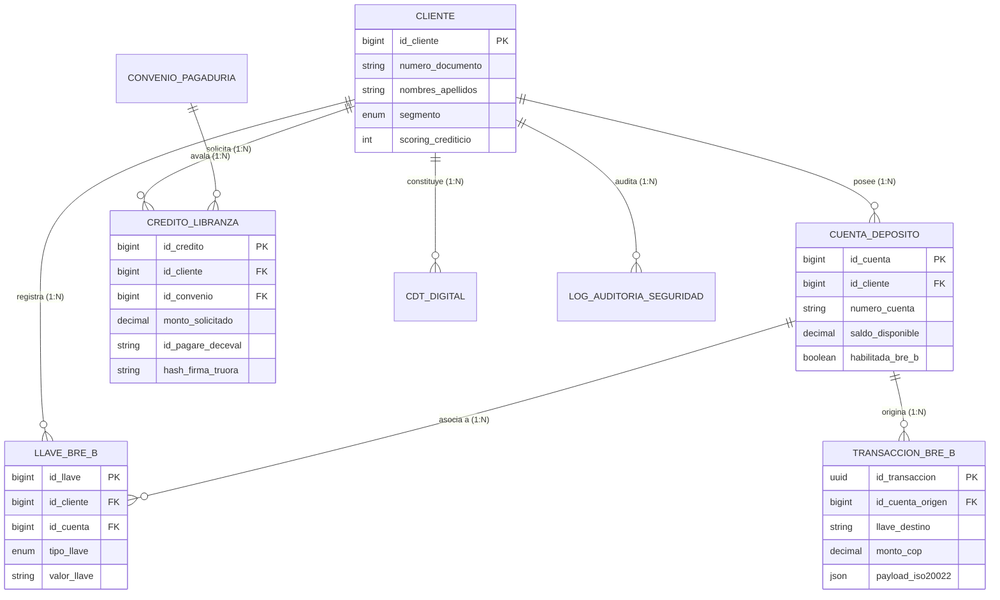
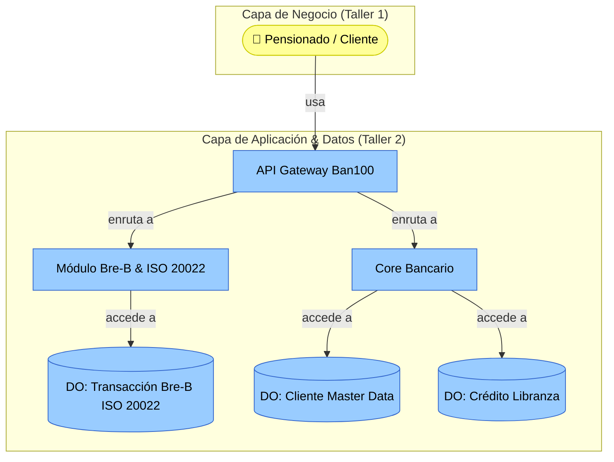

# Informe Técnico del Taller 2: Modelo de Información y Diagrama de Contexto

## Nombre del Taller
**Taller 2 — Modelo de Información (ERD) y Diagrama de Contexto de Negocio: Caso Ban100**  
*Dominio de Información, Ecosistema Bre-B y Delimitación Organizacional*

## Integrantes del Equipo
- **Santiago Barrera Rueda**
- **Krish Purmessur Moros**
- **Samuel Guerrero Arcos**

**Fecha:** 21 de Agosto de 2026  
**Curso:** Arquitectura Empresarial (AREM) — Universidad de La Sabana  
**Entregable del Diagrama (2 Páginas):** [`ban100-modelo-informacion-contexto.drawio`](ban100-modelo-informacion-contexto.drawio)

---

## 1. Descripción General del Trabajo

El objetivo fundamental de este taller consistió en estructurar el **Dominio de Información** y delimitar el **Ecosistema de Contexto e Interoperabilidad** de **Ban100**, en concordancia con el Marco de Referencia de Arquitectura Empresarial (MRAE v3.0 MinTIC), el sistema de Pagos Inmediatos **Bre-B** del Banco de la República y los requerimientos de la **Circular Externa 008 de 2023 de la SFC**.

El trabajo se divide en dos perspectivas complementarias:
1. **Modelo Entidad-Relación Lógico (ERD):** Representa el esquema de datos maestros (**Master Data Management - MDM**), el catálogo de productos financieros misionales (Libranza, CDT, Cuentas), el directorio de "Llaves" y transacciones **ISO 20022** para pagos inmediatos, y los registros de auditoría reforzada para ciberseguridad.
2. **Diagrama de Contexto de Negocio:** Delimita formalmente la frontera interna de Ban100 respecto a los actores externos (Pensionados, Microempresarios, Inversionistas, Pagadurías) y entidades del ecosistema financiero (Aliado Truora, Banco de la República, BTG Pactual, Titularizadora, ResponsAbility y la Superintendencia Financiera).

---

## 2. Proceso de Desarrollo y Metodología

### Parte A — Metodología del Modelo Entidad-Relación (ERD)

1. **Identificación de Entidades Clave:**  
   Se determinaron 8 entidades lógicas distribuidas en cuatro cuadrantes temáticos:
   - *Master Data:* `CLIENTE` (Datos maestros y visión 360°).
   - *Captación e Interoperabilidad:* `CUENTA_DEPOSITO`, `LLAVE_BRE_B`, `TRANSACCION_BRE_B`.
   - *Colocación e Inversión:* `CONVENIO_PAGADURIA`, `CREDITO_LIBRANZA`, `CDT_DIGITAL`.
   - *Seguridad y Control:* `LOG_AUDITORIA_SEGURIDAD`.
2. **Definición de Atributos, PK y FK:**  
   Cada entidad cuenta con su clave primaria única (`PK`), tipos de datos precisos (`BIGINT`, `VARCHAR`, `DECIMAL(18,2)`, `UUID`, `TIMESTAMP`, `JSON`) y claves foráneas (`FK`) que aseguran la integridad referencial.
3. **Establecimiento de Cardinalidades:**  
   Se aplicó la notación *Crow's Foot* (pata de gallo) con cardinalidades formales (1:N y 1:1), etiquetando cada relación con un verbo de negocio (ej. *posee*, *registra*, *origina*, *solicita*, *avala*, *constituye*, *audita*).

### Parte B — Metodología del Diagrama de Contexto de Negocio

1. **Definición del Límite Organizacional:**  
   Se trazó el límite institucional de Ban100 agrupando sus componentes lógicos de misión crítica (Canales Digitales, API Gateway Institucional, Motor de Reglas, Módulo Bre-B, Core Bancario Desacoplado, MDM y SOC con IA).
2. **Identificación y Clasificación de Actores y Sistemas Externos:**  
   - *Actores de Negocio:* Clientes pensionados, microempresarios, inversionistas y pagadurías institucionales.
   - *Aliados Tecnológicos & Terceros:* Truora S.A.S. (Biometría y firma Ley 527) y ResponsAbility (Fondeo internacional).
   - *Entidades Financieras y Reguladoras:* Banco de la República (Cámara Bre-B), BTG Pactual / Titularizadora (Custodia y titularización) y Superintendencia Financiera de Colombia (Supervisión y control).
3. **Trazabilidad de Flujos de Información:**  
   Cada flujo fue conectado y debidamente etiquetado con la semántica del dato intercambiado (ej. *Validación biometría & firma*, *Pagos inmediatos ISO 20022*, *Consulta cupos libranza*, *Cesión de cartera y pagarés*, *Reportes regulatorios & auditoría*).

---

## 3. Análisis del Modelo Propuesto

### Estructura Lógica de Datos (ERD)

### Principales Supuestos y Decisiones de Modelado

1. **Gestión de Llaves Bre-B Desacoplada de las Cuentas:** Una entidad `LLAVE_BRE_B` independiente permite que un cliente registre múltiples alias (celular, cédula, correo o alfanumérico) apuntando a su cuenta de depósito y sincronizándose con el Directorio Central del Banco de la República.
2. **Payload Nativo ISO 20022 en Estructura JSON:** La entidad `TRANSACCION_BRE_B` incorpora un atributo `payload_iso20022: JSON` para almacenar íntegramente los mensajes estándar (`pacs.008`, `pacs.002`, `pain.001`), asegurando interoperabilidad sin forzar transformaciones destructivas de datos.
3. **Inmutabilidad y Cumplimiento de la Circular Externa 008/2023 SFC:** La entidad `LOG_AUDITORIA_SEGURIDAD` almacena el contexto de riesgo, factor MFA utilizado, IP de origen, huella de dispositivo y un `hash_inmutable_bloque` para garantizar no repudio y trazabilidad forense.

---

## 4. Diagrama Final Entregado

El archivo Draw.io contiene las dos vistas requeridas en páginas independientes:
- **Archivo editable:** [`ban100-modelo-informacion-contexto.drawio`](ban100-modelo-informacion-contexto.drawio)
  - **Página 1 (`t2_erd`):** Modelo Entidad-Relación (ERD) Lógico Completo.
  - **Página 2 (`t2_ctx`):** Diagrama de Contexto de Negocio y Límite Organizacional.

---

## 5. Catálogo de Entidades y Componentes del Contexto

### Entidades del Modelo ERD

| Entidad | Tipo | Descripción de Negocio | Claves Principales |
|---|---|---|---|
| `CLIENTE` | Master Data | Registro maestro unificado de personas naturales con datos demográficos y scoring. | `PK: id_cliente` |
| `CUENTA_DEPOSITO` | Transaccional | Cuentas de ahorros y corrientes habilitadas para débitos/créditos y Bre-B. | `PK: id_cuenta`, `FK: id_cliente` |
| `LLAVE_BRE_B` | Interoperabilidad | Catálogo de identificadores rápidos para transferencias inmediatas 24/7. | `PK: id_llave`, `FK: id_cliente`, `FK: id_cuenta` |
| `TRANSACCION_BRE_B` | Transaccional / Evento | Registro de operaciones monetarias inmediatas con payload ISO 20022. | `PK: id_transaccion`, `FK: id_cuenta_origen` |
| `CONVENIO_PAGADURIA` | Maestro / Convenio | Registro de pagadurías institucionales, cupos aprobados y endpoints API. | `PK: id_convenio` |
| `CREDITO_LIBRANZA` | Misional Cartera | Obligaciones crediticias con pagaré electrónico Deceval y firma Truora. | `PK: id_credito`, `FK: id_cliente`, `FK: id_convenio` |
| `CDT_DIGITAL` | Misional Captación | Certificados de depósito desmaterializados aperturados por canales digitales. | `PK: id_cdt`, `FK: id_cliente`, `FK: id_cuenta_debito` |
| `LOG_AUDITORIA_SEGURIDAD` | Seguridad / Auditoría | Trazabilidad inmutable de eventos de acceso, transacciones y MFA (SFC 008). | `PK: id_log`, `FK: id_cliente` |

### Componentes y Entornos del Diagrama de Contexto

| Componente / Actor | Entorno | Rol en el Ecosistema |
|---|---|---|
| **Canales Digitales (App/Web/Bot)** | Interno Ban100 | Interfaces de interacción y captura omnicanal. |
| **API Gateway Institucional** | Interno Ban100 | Fachada segura con mTLS y rate limiting para comunicación interna y externa. |
| **Core Bancario Desacoplado** | Interno Ban100 | Motor financiero transaccional de cuentas y cartera. |
| **MDM & SOC con IA** | Interno Ban100 | Gobernanza central de datos y monitoreo transaccional antifraude. |
| **Aliado Truora S.A.S.** | Externo (Aliado) | Servicios en la nube para biometría facial y firma electrónica Ley 527. |
| **Banco de la República (Bre-B)** | Externo (Infraestructura) | Directorio central y cámara de compensación y liquidación inmediata 24/7. |
| **BTG Pactual & Titularizadora** | Externo (Mercado Capitales) | Titularización de cartera de libranzas y custodia de títulos valores. |
| **Superintendencia Financiera (SFC)** | Externo (Regulador) | Ente de control y supervisión normativa del sistema financiero. |

---

## 6. Investigación Complementaria

### Tema Investigado:
*Gobierno de Datos Maestros (MDM), Adopción del Estándar de Mensajería ISO 20022 en Sistemas de Pagos Inmediatos y Trazabilidad Transaccional según la Circular Externa 008/2023 SFC.*

### Resumen Técnico:
En la banca moderna, la gestión de datos trasciende la persistencia tradicional para convertirse en un activo estratégico de interoperabilidad. El estándar internacional **ISO 20022** define una metodología y un repositorio financiero basado en sintaxis XML/JSON estructurada (`pacs.008` para transferencias de crédito de clientes, `pacs.002` para reportes de estado y `pain.001` para iniciación de pagos). La adopción de este estándar en Colombia, impulsada por el sistema **Bre-B** del Banco de la República, exige que las entidades financieras procesen y persistan mensajes con esquemas de metadatos ricos, eliminando las restricciones de longitud de los antiguos formatos ACH.

Por su parte, la implementación de una estrategia de **Master Data Management (MDM)** resuelve el problema de la fragmentación de clientes entre distintas líneas de producto. Al consolidar un "Golden Record" del cliente que unifique sus productos de libranza, cuentas de depósito y títulos CDT, el banco puede realizar evaluaciones de riesgo en tiempo real y prevenir el sobreendeudamiento.

Finalmente, en materia de seguridad, la **Circular Externa 008 de 2023 de la SFC** establece que todo evento transaccional sensible debe estar respaldado por pistas de auditoría que incluyan geolocalización, score de riesgo y mecanismos de cifrado robustos (AES-256 / TLS 1.3). Integrar estas estructuras dentro del modelo de datos asegura que la entidad mantenga trazabilidad inmutable y esté preparada para inspecciones forenses o requerimientos del regulador sin incurrir en reprocesos.

---

## 7. Vista ArchiMate Equivalente (Capa de Información y Aplicación)

---

## 8. Referencias Bibliográficas

- [1] International Organization for Standardization (ISO). *ISO 20022: Financial Services — Universal Financial Industry Message Scheme*. ISO Standard Catalogue.
- [2] DAMA International. *DAMA-DMBOK: Data Management Body of Knowledge (2nd Edition)*. Technics Publications, 2017.
- [3] Superintendencia Financiera de Colombia (SFC). *Circular Externa 008 de 2023: Instrucciones relativas a la administración del riesgo de ciberseguridad, autenticación robusta y control interno*. Bogotá D.C., 2023.
- [4] Ministerio de Tecnologías de la Información y las Comunicaciones (MinTIC). *Marco de Referencia de Arquitectura Empresarial (MRAE v3.0) — Dominio de Información y Datos*. Bogotá D.C., 2023.

---

_Este documento hace parte de la entrega del Taller 2 del curso AREM (Arquitectura Empresarial) - Universidad de La Sabana._