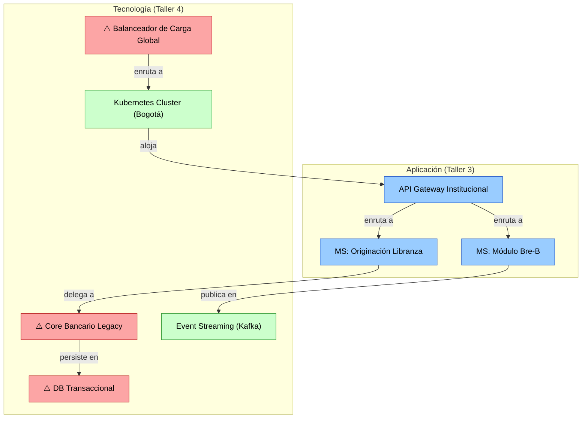

# 📄 Informe Técnico del Taller 4: Mapa de Infraestructura y Diagnóstico Técnico

## 🔖 Nombre del Taller
**Taller 4 — Mapa de Infraestructura y Diagnóstico Técnico: Caso Ban100**
*Dominio Tecnológico del MAE (MRAE v3.0 MinTIC): Arquitectura de Nube Híbrida Multi-Región, Microservicios y Ciberseguridad Zero Trust*

## 👥 Integrantes del Equipo
- **Santiago Barrera Rueda**
- **Krish Purmessur Moros**
- **Samuel Guerrero Arcos**

**Fecha:** 5 de Septiembre de 2026
**Curso:** Arquitectura Empresarial (AREM) — Universidad de La Sabana
**Entregable del Diagrama:** [`mapa-final.drawio`](mapa-final.drawio)

---

## 🧠 1. Descripción General del Trabajo

El objetivo de este taller consistió en construir el **mapa lógico y físico de la infraestructura tecnológica** de Ban100 (estado objetivo TO-BE) y realizar un **diagnóstico técnico priorizado** de debilidades, cuellos de botella y oportunidades de mejora, siguiendo la metodología en 5 pasos del curso.

Ban100 es un establecimiento bancario colombiano con más de 250.000 clientes distribuidos en 900+ municipios, que se encuentra ejecutando un plan de transformación digital hacia una arquitectura basada en **Nube Híbrida Multi-Región**, **Microservicios desacoplados del Core Bancario**, integración nativa con el **Sistema de Pagos Inmediatos Bre-B (ISO 20022)** del Banco de la República, y un modelo de seguridad **Zero Trust** alineado con la **Circular Externa 008 de 2023 de la Superintendencia Financiera de Colombia (SFC)**.

El mapa de infraestructura captura tanto los componentes que ya se encuentran operativos (canales digitales, integración con Truora, Core Bancario legado) como los que forman parte de la hoja de ruta a 24 meses (SOC con IA predictiva, MDM centralizado, Event Streaming y Kubernetes multi-región).

---

## 🔧 2. Proceso de Desarrollo (Metodología en 5 Pasos)

### Paso 1 — Identificar Componentes de Infraestructura

Se elaboró un inventario exhaustivo de los componentes tecnológicos de Ban100 clasificados por naturaleza:

| # | Componente | Naturaleza | Estado Actual |
|---|---|---|---|
| 1 | App Móvil Ban100 (con Bre-B QR) | Canal / Cliente | Operativo |
| 2 | Portal Transaccional Web | Canal / Cliente | Operativo |
| 3 | WhatsApp Bot (Truora) | Canal / Cliente | Operativo |
| 4 | Fuerza de Ventas en Campo | Canal / Cliente | Operativo |
| 5 | CDN de Baja Latencia (Nacional) | Red / Distribución | Proyectado |
| 6 | WAF (Web Application Firewall) | Seguridad Perimetral | Proyectado |
| 7 | Balanceador de Carga Global | Red / Alta Disponibilidad | Mejora requerida |
| 8 | API Gateway Institucional (mTLS) | Integración / Fachada | En implementación |
| 9 | Microservicio: Originación Libranza & Scoring | Aplicación / Negocio | En implementación |
| 10 | Microservicio: CDT Digital & Renovación | Aplicación / Negocio | En implementación |
| 11 | Microservicio: Módulo Bre-B & Llaves ISO 20022 | Aplicación / Interoperabilidad | Proyectado |
| 12 | Microservicio: Validador de Pagadurías | Aplicación / Negocio | En implementación |
| 13 | Motor de Reglas de Negocio | Aplicación / Decisiones | Proyectado |
| 14 | Kubernetes Cluster (Orquestador + Auto-Escalado) | Plataforma / Cómputo | Proyectado |
| 15 | Core Bancario Legacy (Monolítico) | Aplicación / Legacy | Operativo (migración pendiente) |
| 16 | Event Streaming / Message Broker (Kafka) | Integración / Asincronía | Proyectado |
| 17 | API Gateway Réplica (Región Secundaria) | Integración / Contingencia | Proyectado |
| 18 | Kubernetes Cluster Réplica (Activa-Pasiva) | Plataforma / Contingencia | Proyectado |
| 19 | Módulo Bre-B Réplica | Aplicación / Contingencia | Proyectado |
| 20 | Base de Datos Transaccional (Core) | Almacenamiento / Persistencia | Operativo (migración pendiente) |
| 21 | Master Data Management (MDM) | Almacenamiento / Gobernanza | Proyectado |
| 22 | Data Lake / Lakehouse Analítico | Almacenamiento / Analítica | Proyectado |
| 23 | Directorio de Llaves Bre-B (Catálogo) | Almacenamiento / Interoperabilidad | Proyectado |
| 24 | Logs Inmutables de Auditoría (SFC CE 008) | Almacenamiento / Seguridad | Proyectado |
| 25 | SOC 24/7 con Analítica IA Predictiva | Seguridad / Monitoreo | Proyectado |
| 26 | SIEM con IA | Seguridad / Correlación | Proyectado |
| 27 | Autenticación Adaptativa MFA (Biometría Truora) | Seguridad / Identidad | En implementación |
| 28 | Gestión de Identidad y Acceso (IAM / Zero Trust) | Seguridad / Gobierno | Proyectado |
| 29 | Cifrado E2E (TLS 1.3 / AES-256) | Seguridad / Transporte | En implementación |

### Paso 2 — Agrupar por Zona / Capa

Los 29 componentes fueron organizados en **7 zonas lógicas** que reflejan tanto la separación geográfica (región principal vs. contingencia) como la separación funcional (canales, cómputo, datos, seguridad):

1. **Clientes y Canales Digitales** — Puntos de entrada de usuarios (pensionados, microempresarios, inversionistas, fuerza comercial).
2. **Capa de Borde / CDN & Seguridad Perimetral** — Componentes de distribución de contenido, filtrado de tráfico malicioso y balanceo global.
3. **Región Principal — Nube Híbrida (Bogotá)** — Núcleo de procesamiento con API Gateway, microservicios, Kubernetes, Core Legacy y Event Streaming.
4. **Región Contingencia — Nube Híbrida (Región Secundaria)** — Réplicas para alta disponibilidad y continuidad operativa 24/7.
5. **Capa de Datos & Almacenamiento** — Base transaccional, MDM, Data Lake, Directorio de Llaves y Logs de Auditoría.
6. **SOC & Ciberseguridad (Zero Trust)** — Centro de Operaciones de Seguridad, SIEM, IAM y cifrado.
7. **Ecosistema Externo e Interoperabilidad** — Aliados y reguladores: Truora, Banco de la República (Bre-B), Deceval, BTG Pactual, SFC.

### Paso 3 — Conectar los Componentes (Flujo de Tráfico)

Se trazaron las conexiones de red y datos siguiendo el flujo transaccional real:

```
Clientes → CDN → WAF → Balanceador Global
    ├─→ API Gateway Bogotá → Microservicios → Core Legacy → DB Transaccional
    │                       → Event Streaming (Kafka) → MDM / Data Lake
    │                       → Módulo Bre-B → Banco de la República (externo)
    │                       → Originación → Truora (externo, biometría)
    │                       → Core → Deceval / BTG (externos, custodia)
    └─→ API Gateway Réplica → K8s Réplica → Bre-B Réplica

SOC ←·· (monitoreo) ··← API Gateway + Microservicios
SOC → SFC (reportes regulatorios)
SOC → Logs Inmutables de Auditoría
```

### Paso 4 — Marcar Redundancia y Capacidad

Se identificaron y anotaron los estados de redundancia de cada componente crítico:

| Componente | Redundancia | Observación |
|---|---|---|
| CDN | Sí (distribuido) | Múltiples puntos de presencia (PoP) a nivel nacional |
| WAF | Sí (activo-activo) | Reglas sincronizadas entre instancias |
| Balanceador de Carga Global | **Mejora requerida** | Debe evolucionar a activo-activo multi-región (actualmente instancia principal) |
| API Gateway Bogotá | Sí (cluster) | Escalado horizontal dentro del cluster K8s |
| Microservicios | Sí (N réplicas, K8s) | Auto-escalado por HPA (Horizontal Pod Autoscaler) |
| Core Bancario Legacy | **Instancia única** | Monolítico sin escalado horizontal, punto de migración pendiente |
| Kubernetes Cluster Bogotá | Sí (multi-nodo) | 3+ nodos de control, N nodos de trabajo |
| Kafka / Event Streaming | Sí (cluster replicado) | Factor de replicación ≥ 3 |
| DB Transaccional Core | **Escritura única** | Réplica de lectura disponible, pero escritura centralizada + batch nocturno activo |
| MDM | Sí (cluster) | Gobernanza centralizada con réplicas de lectura |
| Módulo Bre-B Réplica (Secundaria) | **Latencia en failover** | RPO ≈ 0, pero RTO > 5 seg en escenario de fallo — crítico para pagos 24/7 |
| SOC / SIEM | Sí (redundante) | Fuentes de telemetría múltiples con correlación centralizada |

### Paso 5 — Diagnosticar y Priorizar

A partir del análisis de redundancia se identificaron los riesgos críticos que constituyen el diagnóstico técnico formal del taller:

---

## ⚠️ 3. Tabla de Diagnóstico Técnico Priorizado

| # | Componente en Riesgo | Riesgo Diagnosticado | Categoría | Impacto si Ocurre | Prioridad | Mitigación Propuesta |
|---|---|---|---|---|---|---|
| **1** | **Core Bancario Legacy (Monolítico)** | Punto de rigidez estructural. No expone APIs nativas. Migración a microservicios incompleta. | Escalabilidad | El banco no puede integrar nuevos servicios (Bre-B, banca abierta) sin desarrollos punto a punto costosos y frágiles. Limita el desacoplamiento del roadmap H2. | **Crítica** | Aceleración del proyecto 2.1 de la hoja de ruta (descomposición progresiva del Core en microservicios mediante patrón Strangler Fig). |
| **2** | **Base de Datos Transaccional (Escritura Única + Batch Nocturno)** | Cuello de botella de rendimiento. El procesamiento por lotes genera latencia de hasta 12 horas en la actualización de saldos y catálogos de Llaves Bre-B. | Rendimiento | Los clientes ven saldos desactualizados durante la ventana nocturna. Impide el procesamiento de pagos inmediatos con datos maestros en tiempo real. | **Crítica** | Implementar Change Data Capture (CDC) sobre la base transaccional para alimentar el Event Streaming (Kafka) y el MDM en tiempo real, eliminando el batch progresivamente. |
| **3** | **Balanceador de Carga Global (Instancia Principal)** | Punto único de falla potencial. Si el balanceador principal falla, todo el tráfico de los 250.000+ clientes queda sin enrutamiento. | Disponibilidad | Caída total de todos los canales digitales (App, Web, WhatsApp). Incumplimiento del SLA 99.99% y de la obligación de disponibilidad 24/7 para Bre-B. | **Alta** | Despliegue de esquema activo-activo multi-región con DNS global health checks y failover automático (< 30 segundos). |
| **4** | **Módulo Bre-B Réplica (Región Secundaria)** | Latencia en failover para pagos inmediatos 24/7. El RTO actual del módulo réplica supera los 5 segundos, lo que genera timeout en la cámara de compensación del Banco de la República. | Disponibilidad | Transacciones Bre-B rechazadas o con timeout durante el failover, generando incumplimiento regulatorio y pérdida de confianza del ecosistema financiero. | **Alta** | Evolucionar de activa-pasiva a activa-activa con sincronización de estado del Directorio de Llaves mediante Event Streaming geo-replicado. |
| **5** | **Región Medellín / Secundaria sin microservicios completos** | Límite de escalabilidad geográfica. La región de contingencia no cuenta con réplicas de todos los microservicios misionales (Originación, CDT, Pagadurías). | Escalabilidad | En caso de fallo de la región principal, sólo los pagos Bre-B básicos se mantienen operativos. Los procesos de originación de libranza y captación se detienen completamente. | **Media** | Desplegar el stack completo de microservicios en ambas regiones bajo el patrón multi-región activa-activa con Kubernetes Federation. |

---

## 🧩 4. Análisis del Modelo Propuesto

### Estructura y Zonas del Mapa

El mapa de infraestructura se estructura en 7 zonas que reflejan fielmente la arquitectura objetivo de Ban100 articulada en el Dominio Tecnológico del MAE (MRAE v3.0 MinTIC). La separación en zonas permite identificar con claridad dónde se concentran los riesgos:

- **Zona de mayor riesgo acumulado:** La intersección entre el *Core Bancario Legacy* (Zona 3) y la *Base de Datos Transaccional* (Zona 5) concentra los dos hallazgos de prioridad **Crítica**, ya que ambos son herencias del modelo monolítico y representan las dependencias más difíciles de eliminar durante la transformación.
- **Zona de mayor impacto regulatorio:** La *Capa de Borde* (Zona 2) y la *Región de Contingencia* (Zona 4) determinan la capacidad de cumplir con el SLA del 99.99% y la disponibilidad continua 24/7/365 exigida por el Banco de la República para los pagos Bre-B.
- **Zona mejor posicionada:** El *SOC & Ciberseguridad* (Zona 6) presenta un diseño robusto con redundancia nativa, alineado desde su concepción con los controles de la Circular Externa 008/2023 SFC.

### Representación de las Necesidades del Cliente

El mapa refleja directamente los objetivos estratégicos formulados en la Ficha de Caracterización (Taller 0):

| Objetivo Estratégico | Componente(s) del Mapa que lo Habilita(n) |
|---|---|
| Inclusión financiera en 900+ municipios | CDN Nacional + App Móvil + WhatsApp Bot + Microservicio de Originación |
| Pagos inmediatos 24/7 (Bre-B) | Módulo Bre-B + Directorio de Llaves + Banco de la República (externo) |
| Eficiencia operativa y automatización | Motor de Reglas + Microservicio Validador de Pagadurías + Event Streaming |
| Cumplimiento regulatorio Zero Trust | SOC + SIEM + IAM + MFA Truora + Logs Inmutables + Cifrado E2E |

### Supuestos Técnicos Adoptados

1. La migración del Core Bancario Legacy sigue el **patrón Strangler Fig**: los microservicios envuelven progresivamente las funciones del monolito sin reescribirlo de raíz, manteniendo compatibilidad operativa durante la transición.
2. El esquema de **Nube Híbrida Multi-Región** contempla un proveedor de nube pública para la capa de cómputo (Kubernetes) y una conexión dedicada (ExpressRoute / Direct Connect) al centro de datos on-premise donde aún reside el Core Legacy.
3. El **Event Streaming (Kafka)** actúa como columna vertebral de desacoplamiento asíncrono entre el Core Legacy y los nuevos microservicios, permitiendo la coexistencia sin integraciones punto a punto.
4. El **Directorio de Llaves Bre-B** es una réplica local del Directorio Central del Banco de la República, sincronizada en tiempo real mediante eventos.

---

## 📈 5. Diagrama Final Entregado

- **Archivo editable:** [`mapa-final.drawio`](mapa-final.drawio)
- **Instrucciones de apertura:** Puede abrirse directamente en VS Code utilizando la extensión `hediet.vscode-drawio` o en el entorno web [app.diagrams.net](https://app.diagrams.net/).
- **Contenido:** Mapa de infraestructura TO-BE completo con 7 zonas, 29 componentes, flujos de tráfico etiquetados y 5 componentes diagnósticados con riesgo (marcados en rojo con ⚠️).

---

## 📋 6. Tabla de Componentes de Infraestructura

| Componente | Zona | Tipo | Redundancia | Responsable |
|---|---|---|---|---|
| App Móvil Ban100 (Bre-B QR) | Clientes | Canal Mobile | N/A (endpoint) | Dir. Canales Digitales |
| Portal Transaccional Web | Clientes | Canal Web | N/A (endpoint) | Dir. Canales Digitales |
| WhatsApp Bot (Truora) | Clientes | Canal Conversacional | SaaS redundante | Dir. Canales / Truora |
| CDN Nacional | Borde | Red de Distribución | Sí (multi-PoP) | VP de TI |
| WAF | Borde | Seguridad Perimetral | Sí (activo-activo) | VP de TI / SOC |
| ⚠️ Balanceador Global | Borde | Alta Disponibilidad | **Mejora requerida** | VP de TI |
| API Gateway (mTLS) | Bogotá | Fachada de Servicios | Sí (cluster K8s) | VP de TI |
| MS: Originación Libranza | Bogotá | Microservicio | Sí (HPA K8s) | VP Riesgos / TI |
| MS: CDT Digital | Bogotá | Microservicio | Sí (HPA K8s) | Dir. Captación / TI |
| MS: Módulo Bre-B & Llaves | Bogotá | Microservicio | Sí (HPA K8s) | VP de TI |
| MS: Validador Pagadurías | Bogotá | Microservicio | Sí (HPA K8s) | VP Riesgos / TI |
| Motor de Reglas | Bogotá | Motor Decisional | Sí (cluster) | VP Riesgos |
| Kubernetes Cluster | Bogotá | Orquestador | Sí (multi-nodo) | VP de TI |
| ⚠️ Core Bancario Legacy | Bogotá | Monolito Legacy | **Instancia única** | VP de TI |
| Event Streaming (Kafka) | Bogotá | Message Broker | Sí (RF ≥ 3) | VP de TI |
| API Gateway Réplica | Contingencia | Fachada Réplica | Sí (failover) | VP de TI |
| K8s Cluster Réplica | Contingencia | Orquestador Réplica | Sí (activa-pasiva) | VP de TI |
| ⚠️ Módulo Bre-B Réplica | Contingencia | Microservicio Réplica | **Latencia en failover** | VP de TI |
| ⚠️ DB Transaccional Core | Datos | Base de Datos | **Escritura única + batch** | VP de TI |
| MDM (Visión 360°) | Datos | Gobernanza Datos | Sí (cluster) | Dir. Datos / TI |
| Data Lake / Lakehouse | Datos | Analítica | Sí (distribuido) | Dir. Datos / TI |
| Directorio Llaves Bre-B | Datos | Catálogo Interop. | Sí (sincronizado) | VP de TI |
| Logs Auditoría (SFC 008) | Datos | Almacenamiento Inmutable | Sí (WORM) | SOC / VP Riesgos |
| SOC 24/7 | Seguridad | Centro Operaciones | Sí (redundante) | VP Riesgos / CISO |
| SIEM con IA | Seguridad | Correlación Eventos | Sí (cluster) | CISO |
| MFA Adaptativo (Truora) | Seguridad | Autenticación | SaaS redundante | Dir. Canales / Truora |
| IAM / Zero Trust | Seguridad | Gobierno Acceso | Sí (federado) | CISO |
| Cifrado E2E | Seguridad | Transporte Seguro | N/A (protocolo) | VP de TI |

---

## 🔍 7. Investigación Complementaria

### Tema Investigado:
*Buenas Prácticas de Arquitectura de Infraestructura en Banca: Nube Híbrida Multi-Región, Resiliencia Activa-Activa y Patrón Strangler Fig para Migración de Core Bancario.*

### Resumen:

La transformación de la infraestructura tecnológica en el sector bancario colombiano se enfrenta a un dilema recurrente: la necesidad de mantener la estabilidad y disponibilidad ininterrumpida de los servicios financieros (exigida por la SFC y el Banco de la República) mientras se moderniza una base tecnológica que en muchos casos tiene más de una década de antigüedad. El **patrón Strangler Fig** (Fowler, 2004) ofrece una estrategia de migración incremental en la que los nuevos microservicios interceptan progresivamente las funciones del monolito hasta que éste puede ser retirado sin riesgo. En el caso de Ban100, este enfoque permite que el Core Bancario Legacy continúe procesando transacciones de cartera y captaciones mientras los microservicios de Originación de Libranza, CDT Digital y Bre-B se despliegan y estabilizan de forma independiente.

La adopción de **Nube Híbrida Multi-Región** con esquema **activa-activa** es la práctica estándar para alcanzar SLAs de disponibilidad del 99.99% (equivalente a menos de 52 minutos de indisponibilidad anuales). AWS, Azure y GCP ofrecen regiones en América Latina (São Paulo, Bogotá, Chile) que permiten desplegar clústeres de Kubernetes geo-distribuidos con failover automático por DNS global. Para sistemas de pagos en tiempo real como Bre-B, donde la latencia de failover es crítica, la evolución hacia réplicas activas-activas con sincronización de estado vía Event Streaming (Kafka MirrorMaker 2 o Confluent Cluster Linking) es preferible al modelo activa-pasiva tradicional.

Finalmente, la adopción del modelo de seguridad **Zero Trust** ("nunca confiar, siempre verificar") implica que cada microservicio valide la identidad y los permisos del solicitante mediante tokens JWT firmados y mTLS, independientemente de que el tráfico provenga de la red interna del banco. Este principio, combinado con el despliegue de un SOC equipado con analítica predictiva (ML/IA para detección de anomalías transaccionales), posiciona a Ban100 para cumplir con los controles reforzados de la Circular Externa 008/2023 de la SFC, incluyendo el monitoreo continuo de pasarelas de pago y la generación de pistas de auditoría inmutables.

---

## 🏛️ 8. Vista ArchiMate Equivalente (Capa de Tecnología)



El balanceador, el Core Legacy y la DB transaccional aparecen marcados como riesgos en la capa de Tecnología. Estos mismos componentes se convertirán en el Taller 7 (Gap Analysis) en **Gaps de la capa de Implementación y Migración** de ArchiMate, vinculados a los proyectos del Horizonte 1 y 2 de la hoja de ruta de transformación.

---

## 📚 9. Referencias

- [1] Fowler, M. *Strangler Fig Application*. martinfowler.com, 2004. https://martinfowler.com/bliki/StranglerFigApplication.html
- [2] Microsoft Azure. *Multi-region deployment for high availability*. Azure Architecture Center, 2024. https://learn.microsoft.com/en-us/azure/architecture/reference-architectures/app-service-web-app/multi-region
- [3] Superintendencia Financiera de Colombia (SFC). *Circular Externa 008 de 2023*. Bogotá D.C., 2023.
- [4] Banco de la República de Colombia. *Reglamentación del Sistema de Pagos Inmediatos Interoperables (Bre-B) y Adopción del Estándar ISO 20022*. Circular Reglamentaria Externa DSP-2023.
- [5] MinTIC. *Marco de Referencia de Arquitectura Empresarial (MRAE v3.0) — Dominio Tecnológico*. Bogotá D.C., 2023.
- [6] NIST. *SP 800-207: Zero Trust Architecture*. National Institute of Standards and Technology, 2020. https://csrc.nist.gov/publications/detail/sp/800-207/final

---

_Este documento hace parte de la entrega del Taller 4 del curso AREM (Arquitectura Empresarial) - Universidad de La Sabana._

